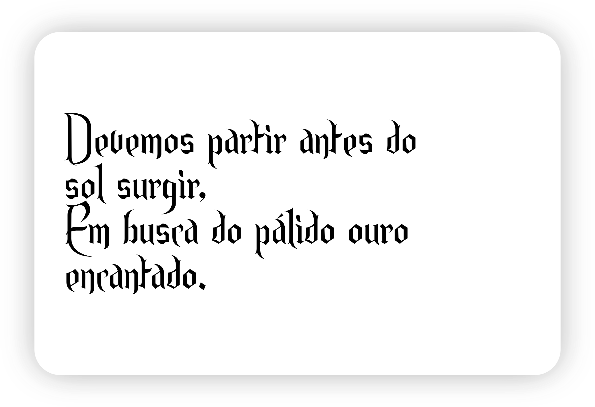

# fontes

Um lugar pra centralizar as fontes que uso

## Fontes

### [Endor](https://www.dafont.com/endor.font) 

Liscence: "100% free"

### [Jost](https://fonts.google.com/specimen/Jost)

Liscence: Open Font License

### [Knawave](https://github.com/theleagueof/knewave) 

Liscence: Open Font License

### [Lato](https://fonts.google.com/specimen/Lato?query=La)

Liscence: Open Font License

### [League Spartan](https://github.com/theleagueof/league-spartan)

Liscence: Open Font License

### [Metropolis](https://github.com/chrismsimpson/Metropolis)

### [Open Sans](https://fonts.google.com/specimen/Open+Sans?query=Open)

Liscence: Apache License

### [Roboto](https://fonts.google.com/specimen/Roboto?query=Roboto)

Liscence: Apache License

### [Spartan](https://fonts.google.com/specimen/Spartan?query=Spa)

Liscence: Open Font License
